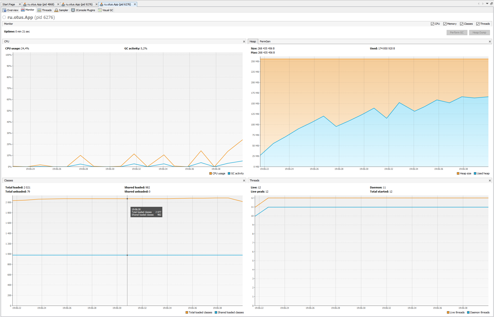
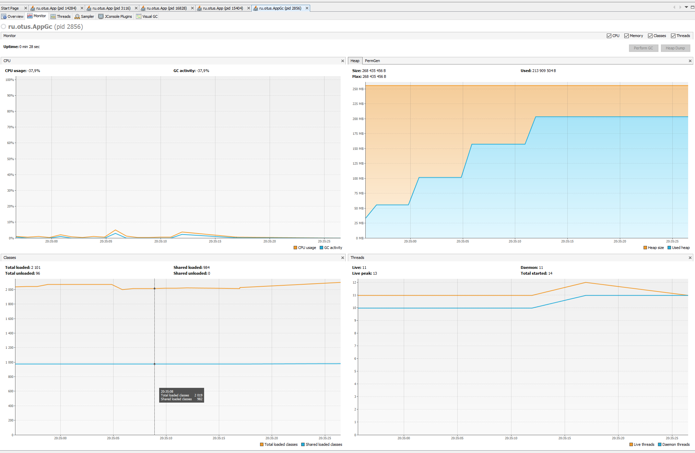
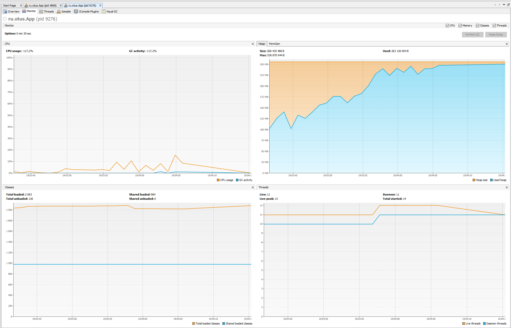
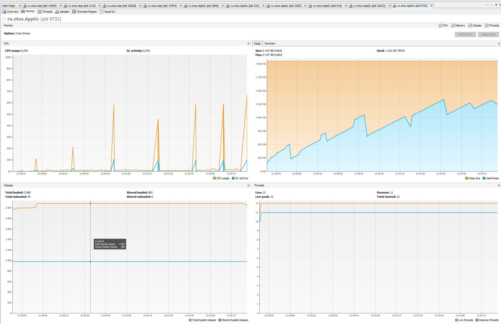
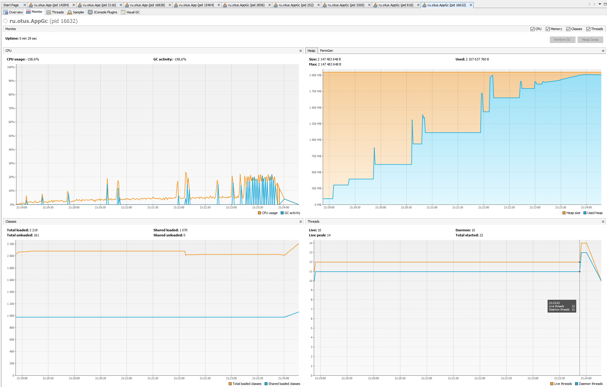
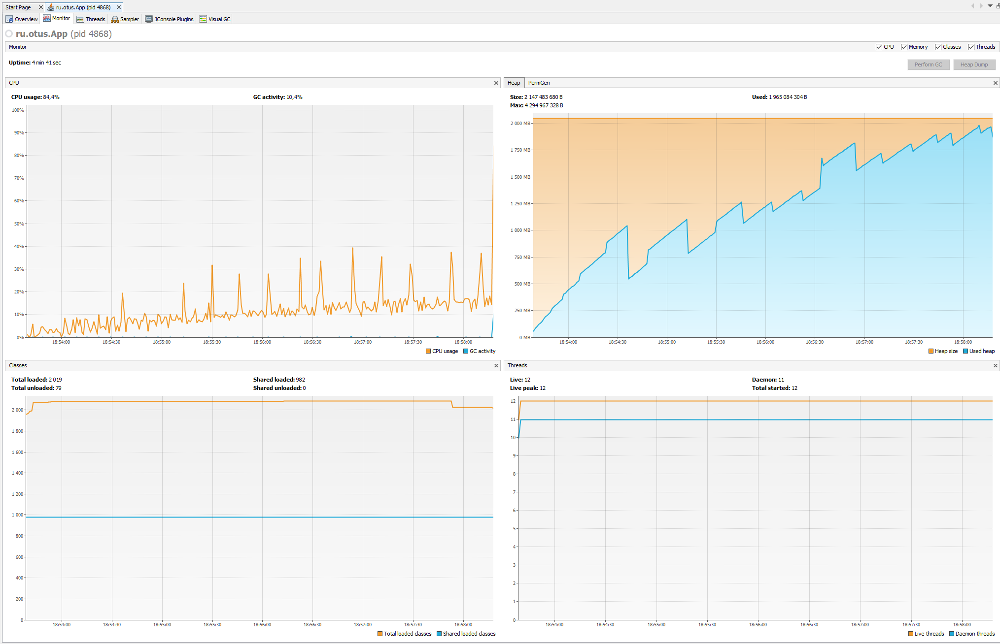

Итоги тестирования gc:

Параметры:
`-Xms256m -Xmx256m`

#-XX:+UseParallelGC

```
Отчет
Общее время ряботы GC: 1794 ms
Количестчо элементов добавленных в список: 12253400
Название GC: PS MarkSweep, количество запусков: 7 время работы 1566.0
Название GC: PS Scavenge, количество запусков: 7 время работы 228.0
1 мин GC работал --> 1794.0 сек

BUILD SUCCESSFUL in 22s
```



#-XX:+UseZGC

```
Отчет
Общее время ряботы GC: 1051 ms
Количестчо элементов добавленных в список: 12253400
Название GC: ZGC, количество запусков: 14 время работы 1051.0
1 мин GC работал --> 1051.0 сек

BUILD SUCCESSFUL in 21s
```



#-XX:+UseG1GC

```
Отчет
Общее время ряботы GC: 807 ms
Количестчо элементов добавленных в список: 18380100
Название GC: G1 Young Generation, количество запусков: 33 время работы 296.0
Название GC: G1 Old Generation, количество запусков: 6 время работы 511.0
1 мин GC работал --> 807.0 сек

BUILD SUCCESSFUL in 30s
```



Параметры:
`-Xms2048m -Xmx2048m`

#-XX:+UseParallelGC

```
Отчет
Общее время ряботы GC: 13867 ms
Количестчо элементов добавленных в список: 93377380
Название GC: PS MarkSweep, количество запусков: 6 время работы 10742.0
Название GC: PS Scavenge, количество запусков: 8 время работы 3125.0
1 мин GC работал --> 354.0 сек
2 мин GC работал --> 4841.0 сек
3 мин GC работал --> 8672.0 сек

BUILD SUCCESSFUL in 2m 56s
```



#-XX:+UseZGC

```
Отчет
Общее время ряботы GC: 70344 ms
Количестчо элементов добавленных в список: 126113692
Название GC: ZGC, количество запусков: 55 время работы 69433.0
1 мин GC работал --> 795.0 сек
2 мин GC работал --> 1843.0 сек
3 мин GC работал --> 2395.0 сек
4 мин GC работал --> 7720.0 сек
5 мин GC работал --> 35266.0 сек
6 мин GC работал --> 18715.0 сек

BUILD SUCCESSFUL in 5m 29s
```



#-XX:+UseG1GC

```
Отчет
Общее время ряботы GC: 2220 ms
Количестчо элементов добавленных в список: 140091070
Название GC: G1 Young Generation, количество запусков: 38 время работы 1101.0
Название GC: G1 Old Generation, количество запусков: 2 время работы 1119.0
1 мин GC работал --> 293.0 сек
2 мин GC работал --> 214.0 сек
3 мин GC работал --> 216.0 сек
4 мин GC работал --> 207.0 сек
5 мин GC работал --> 1290.0 сек

BUILD SUCCESSFUL in 4m 43s
```



Выводы:
Очевидно что с данной задачей на много лучше справился G1GC, если говорить о времени работы приложения и о времени рабботы gc.
Приложение с ним отработало дольше, при этом сам gc работал меньше времени и кол-во обработанных элементов в List так же больше при G1GC
Так же G1 лидирует и по количеству запущенных процессов (первая для 256 второе значение для 2048):
```
G1 - > 39 и 40 
Parallel -> 14 и 14
ZGC -> 14 и 55
```
Можно заметить по графикам что этому соответствует более эффективное использование процессора.
Если обратить внимание на общее колличество времени потраченное на работу GC в целом (первая для 256 второе значение для 2048):
```
G1 - > 807 и 2220 ms
Parallel -> 1794 и 13867 ms
ZGC -> 1051 и 70344 ms
```
Можно сделать вывод, что G1GC лучше остальных проявил себя в данном тесте, если речь идет о времени работы приложения без OOM. 
На мой взгяд это связанно с тем, что большую часть работы он выполняет паралельно общему потоку приложения, но при этом задейсвуется больше ресурсов процессора. 
Отсутствие фрагментации памяти, так же является плюсом этого сборщика мусора.
